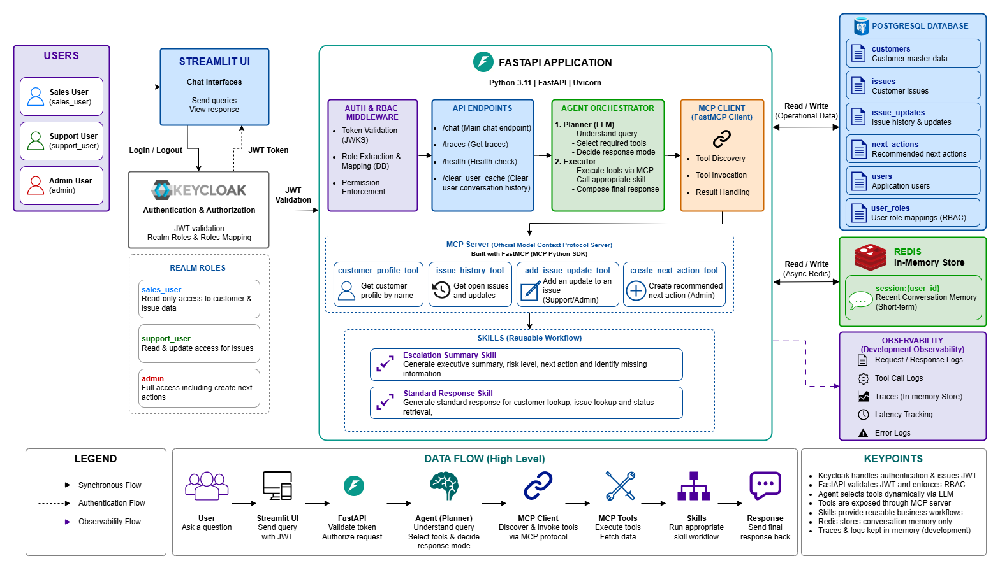
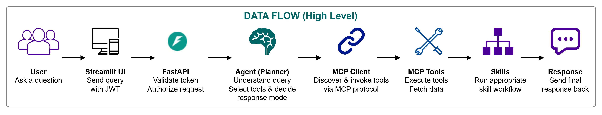

# Acme Operations — Agentic Enterprise Assistant

## Overview

Acme Operations is a locally runnable agentic enterprise assistant designed to help internal users retrieve customer information, investigate operational issues, and perform controlled support actions through a natural language interface.

The solution demonstrates a realistic enterprise architecture that combines:
- Keycloak authentication
- PostgreSQL-backed authorization and operational data
- Redis conversation memory
- LLM-driven planning and tool selection
- Official MCP (Model Context Protocol) integration
- Reusable AI skills
- Evaluation and observability
- End-to-end Docker Compose deployment

The assistant can dynamically determine which tools to invoke, retrieve grounded information from enterprise data, enforce role-based access control, and generate actionable recommendations for support and operations teams.

## Assessment Objectives Demonstrated
This solution demonstrates all required capabilities from the assessment brief:
- Agentic tool selection
- PostgreSQL integration
- Redis memory
- Keycloak authentication
- Role-based access control
- MCP integration
- Reusable skills
- Evaluation framework
- Observability and tracing
- Docker Compose deployment

## Architecture


The solution is composed of several independently deployable services that work together to provide a secure and auditable enterprise assistant experience.
- Streamlit provides the user interface.
- FastAPI acts as the orchestration layer and hosts the agent.
- Keycloak provides authentication and identity verification.
- PostgreSQL stores operational data and application authorization roles.
- Redis stores short-term conversation memory.
- The MCP server exposes enterprise tools using the official Model Context Protocol (MCP) SDK, allowing tool discovery and invocation through a standardized protocol.

The agent follows a planner-executor pattern. The planner uses an LLM to determine the appropriate tool and response mode, while the executor invokes the selected tool, applies authorization checks, and passes structured data to reusable skills for response generation.

### High-Level Flow


The interaction lifecycle follows the sequence below:
1. User authenticates through Keycloak.
2. FastAPI validates the JWT and loads the user's application role.
3. Conversation history is loaded from Redis.
4. The planner determines the appropriate tool and response mode.
5. Executor invokes tool through MCP
6. Tool-level authorization is performed.
7. Enterprise data is retrieved from PostgreSQL.
8. A reusable skill generates the final response.
9. Traces and logs are recorded.
10. The response is returned to the user.

This flow ensures responses remain grounded in enterprise data while maintaining security, auditability, and role-based access control.

## Components

### FastAPI
The FastAPI service acts as the orchestration layer for the assistant.

Responsibilities include:
- JWT validation using Keycloak
- Loading conversation history from Redis
- Invoking the planner and executor
- Managing tool execution
- Enforcing RBAC
- Recording traces and logs
- Returning final responses to the UI

Key endpoints include:
- `/chat`
- `/traces`
- `/health`
- `/clear_user_cache`

### PostgreSQL
Durable store for:
- customers
- issues
- issue_updates
- next_actions
- users
- user_roles

PostgreSQL serves two purposes:
- Durable storage for operational customer support data.
- Application-level authorization.

After Keycloak authenticates a user and the JWT is validated, the application extracts the username from the token and verifies that the user is onboarded to Acme Assistant by checking the users table.

The application then retrieves the user’s application role from the user_roles table and enforces RBAC based on the database role.

This design allows application permissions to be managed independently of the identity provider and prevents authenticated corporate users from automatically receiving access to the application.

### Redis
Redis is used for short-term conversational memory.

For each authenticated user, recent conversation history is stored and loaded before planning and response generation.

Redis was selected because:
- Conversation memory is ephemeral
- Low-latency retrieval is required
- Data does not need long-term durability

This allows the assistant to maintain conversational context without storing transient interactions in PostgreSQL.

### Keycloak
Keycloak is the identity provider for the platform.

The application validates JWT tokens using Keycloak’s OpenID Connect discovery endpoint and JWKS public keys.

Validation includes:
* Signature verification
* Issuer validation
* Expiration validation

Keycloak is responsible for authentication and identity verification.

Authorization decisions are not taken directly from the JWT. Instead, the authenticated username is used to retrieve application-specific roles from PostgreSQL, allowing Acme Assistant to manage access independently of enterprise identity management.

### MCP Server
The MCP server exposes enterprise tools through a dedicated service boundary.

The agent interacts with tools through the MCP layer rather than embedding business integrations directly inside planner logic.

Benefits include:
- Standards-based MCP tool discovery
- Standards-based MCP tool invocation
- Reusable integrations
- Simplified agent architecture
- Easier future integrations with enterprise systems

This approach allows new tools to be introduced without requiring changes to the core planning workflow.

## Agent Workflow
1. User authenticates through Keycloak and obtains a JWT.
2. User submits a query through Streamlit or the API.
3. FastAPI validates the JWT and loads application roles from PostgreSQL.
4. Conversation history is loaded from Redis.
5. The planner analyzes the query and selects:
   - The appropriate tool
   - The required tool arguments
   - The response mode
6. The executor invokes the selected tool.
7. Tool-level RBAC checks are performed.
8. Structured data is retrieved from PostgreSQL.
9. The appropriate skill generates the final response.
10. Conversation memory is updated in Redis.
11. Observability events and traces are recorded.
12. The final response is returned to the user.

## Available Tools

| Tool | Purpose | Access |
|--------|----------|----------|
| customer_profile_tool | Retrieves customer information, open issues, and operational status | sales_user, support_user, admin |
| issue_history_tool | Retrieves issue history and update timelines | sales_user, support_user, admin |
| add_issue_update_tool | Records updates on existing issues | support_user, admin |
| create_next_action_tool | Creates recommended next actions | admin |

### Skills

### Standard Response Skill
Used for operational lookups and factual responses.

Responsibilities:
- Format customer information
- Format issue history
- Generate grounded operational responses
- Present retrieved data in a user-friendly format

### Escalation Summary Skill
Used for executive and escalation-focused analysis.

Outputs:
- Executive Summary
- Risk Level
- Recommended Next Action
- Missing Information

This skill demonstrates reusable workflow logic that can be invoked independently of specific tools.

## Authentication & RBAC

| Role | Permissions                                                   |
|------|---------------------------------------------------------------|
| sales_user | Read-only customer and issue access                           |
| support_user | Read access plus ability to add issue updates                 |
| admin | Full access including issue updates and next actions creation |

### Authorization Flow
1. User authenticates through Keycloak.
2. JWT is validated by the FastAPI service.
3. Username is extracted from the token.
4. Application verifies the user exists in the users table.
5. Application retrieves the role from the user_roles table.
6. Tool-level authorization is enforced using the application role.

This separation allows identity management and application authorization to evolve independently.

## Redis Usage
Redis is used as the short-term memory layer for the assistant.

Stored information includes:
- Recent user messages
- Recent assistant responses
- Session conversation history

Redis was chosen because conversational memory is transient and requires low-latency retrieval.

PostgreSQL is reserved for durable operational data, while Redis handles ephemeral context required for multi-turn interactions.

## MCP Usage

The solution uses the official Model Context Protocol (MCP) Python SDK to expose enterprise tools through a dedicated MCP server.

The FastAPI application acts as an MCP client, while the MCP service acts as an MCP server responsible for tool discovery and tool execution.

Available enterprise tools are exposed through MCP rather than being directly coupled to the agent implementation. This allows the planner and executor to remain independent of individual tool implementations and provides a standardized interface for future integrations.

Benefits of this approach include:
- Standardized tool discovery
- Standardized tool invocation
- Separation of tool implementations from agent orchestration
- Independent evolution of enterprise integrations
- Improved maintainability and extensibility
- Compatibility with MCP-based ecosystems

The agent uses MCP to invoke enterprise capabilities such as customer profile retrieval, issue history retrieval, issue updates, and next action creation. New tools can be added to the MCP server without requiring changes to the core planning workflow.

This demonstrates how enterprise systems can be integrated through a standards-based protocol while keeping agent orchestration logic clean, reusable, and maintainable.
 
## Observability
The platform includes basic observability features to support debugging and operational visibility.

Captured signals include:
- Request logs
- Error logs
- Request IDs
- Trace IDs
- Tool execution logs
- Tool selection decisions
- End-to-end request traces
- Latency measurements

These capabilities allow operators to understand how the agent reached a response and diagnose failures during execution.

### Custom Trace Viewer
A lightweight trace viewer is available through the Streamlit UI.

The viewer provides visibility into:
- Planner decisions
- MCP tool executions
- Skill selection
- Tool usage statistics

- This enables end-to-end inspection of how the assistant generated a response and serves as a lightweight custom trace viewer for agent execution analysis.

## Running Locally

```bash
GROQ_API_KEY=<input_groq_api_key> docker compose up -d --build
```

Services:

- FastAPI
- PostgreSQL
- Redis
- Keycloak
- MCP Server
- Streamlit UI

## Sample Queries

- What is happening with Globex?
- Show me open issues for Initech.
- Summarise the history of issue 3.
- Create a next action for issue 5.
- How bad is the Initech situation?
- Add update to issue 3 saying vendor confirmed root cause.
- Record that issue 5 has been fixed and validated.

## Evaluation

Evaluation covers:

- Tool selection accuracy
- Database grounding
- RBAC validation
- Recommendation quality

Summary Results:
- Tool Selection Accuracy: 100%
- RBAC Validation: 100%
- Database Grounding: 100%
- Recommendation Generation: 100%

Artifacts:

- [evals/test_cases.json](evals/test_cases.json)
- [evals/results.json](evals/results.json)
- [evals/summary.md](evals/summary.md)

## Trade-offs

The assessment prioritizes a fully runnable local solution over production-scale infrastructure.

The following simplifications were intentionally made:

### Observability

Traces are currently stored in memory and exposed through a lightweight trace endpoint. Trace inspection is restricted to administrators because traces may contain operational metadata.

Production alternatives:
- OpenTelemetry
- LangSmith
- Arize Phoenix

### Data

The system uses seeded enterprise data to enable deterministic demonstrations and evaluation.

Production implementations would integrate with operational systems and external databases.

### Authorization

Application authorization is maintained in PostgreSQL while authentication is delegated to Keycloak.

This separation allows enterprise identity management and application permissions to evolve independently.

### Deployment

The solution is designed to run locally through Docker Compose using a single command.

Production deployment would likely use Kubernetes, managed databases, centralized logging, and secret management.

## AI Tool Usage

AI-assisted development tools were used to accelerate implementation.

Areas where AI assistance was used:
- Docker Compose scaffolding
- Initial Keycloak configuration
- Prompt engineering iterations
- Boilerplate FastAPI code
- Documentation drafting
- Test case generation

Human validation included:
- Reviewing all generated code
- Testing authentication flows
- Validating RBAC behavior
- Verifying database interactions
- Fixing planner validation issues
- Correcting evaluation logic
- Ensuring assessment requirements were satisfied

No AI-generated code was accepted without review and testing.
 
## Repository Structure

```text
app/                # FastAPI application
keycloak/           # Keycloak configuration
mcp_server/         # MCP tool server
seed/               # Database seed scripts
ui/                 # Streamlit frontend
evals/              # Evaluation framework
docs/               # Architecture diagrams
docker-compose.yml
README.md
```

## Assessment Requirement Mapping
| Assessment Requirement | Implementation                                                                                                     |
|------------------------|--------------------------------------------------------------------------------------------------------------------|
| Keycloak Authentication | Keycloak container with JWT validation using OpenID Connect discovery and JWKS public keys                         |
| Role-Based Access Control (RBAC) | PostgreSQL-backed application roles stored in `users` and `user_roles` tables                                      |
| PostgreSQL | Durable storage for customers, issues, issue updates, next actions, users, and user roles                          |
| Redis Memory | Conversation history and short-term session memory                                                                 |
| Agentic Tool Selection | LLM-powered planner dynamically selects tools based on user intent                                                 |
| Customer Profile Retrieval | `customer_profile_tool` retrieves customer information and open issues                                             |
| Issue History Retrieval | `issue_history_tool` retrieves issue updates and issue timelines                                                   |
| Next Action Creation | `create_next_action_tool` creates recommended next actions for issues                                              |
| Issue Updates | `add_issue_update_tool` records operational updates on existing issues                                             |
| MCP Integration | Official MCP server and MCP client implemented using the MCP python SDK for tool discovery and invocation          |
| Reusable Skill | Escalation Summary Skill generates executive summaries, risk assessments, recommendations, and missing information |
| Evaluation Framework | `evals/test_cases.json`, `evals/results.json`, and `evals/summary.md`                                              |
| Observability | Request logging, trace IDs, tool execution traces, error logs, and latency tracking                                |
| Docker Compose Deployment | FastAPI, PostgreSQL, Redis, Keycloak, MCP Server, and Streamlit UI deployed via Docker Compose                     |
| Streamlit UI | Simple user interface for interacting with the assistant                                                           |
| Sample Enterprise Data | Seeded customers, issues, issue updates, next actions, users, and role mappings                                    |

### Assessment Coverage Summary
This implementation satisfies all mandatory assessment requirements:
- ✅ Keycloak Authentication
- ✅ Role-Based Access Control (sales_user, support_user, admin)
- ✅ PostgreSQL Integration
- ✅ Redis Memory
- ✅ Agentic Tool Selection
- ✅ Dynamic Tool Invocation
- ✅ MCP Server Integration
- ✅ Reusable Skill Implementation
- ✅ Evaluation Dataset and Results
- ✅ Observability and Tracing
- ✅ Docker Compose Deployment
- ✅ End-to-End Demonstrable Solution

## Demo Checklist

### Authentication
- Keycloak login works
- JWT validation works

### Authorization
- sales_user can view customer data
- support_user can add issue updates
- admin can create next actions

### Agent Capabilities
- Tool routing works
- Escalation skill works
- Standard response skill works

### Infrastructure
- Redis memory works
- PostgreSQL queries work
- MCP server discovery works
- MCP tool invocation works

### Observability
- Traces visible
- Request logs visible
- Tool execution logs visible

### Deployment
- Docker Compose starts entire stack
