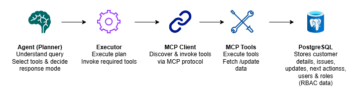

# MCP Integration
## What is MCP?

Model Context Protocol (MCP) provides a standardized way for AI agents to discover and invoke tools.

Instead of embedding tool implementations directly into agent logic, MCP exposes tools through a separate interface.

---
## Why MCP Was Used
The assessment explicitly requires at least one MCP server.

This project uses a dedicated MCP server to expose enterprise tools and separate tool implementation from agent orchestration.

Benefits:
- Separation of concerns
- Independent tool lifecycle
- Easier extensibility
- Cleaner architecture
- Reduced coupling
---
## Architecture

The FastAPI application acts as an MCP client and communicates with a dedicated MCP server using the official MCP Python SDK.

The MCP server exposes enterprise tools that can be discovered and invoked by the agent. This separation allows tool implementations to evolve independently of planner and executor logic.

---
## Available MCP Tools
### customer_profile_tool
Retrieves:
- Customer information
- Customer health
- Open issues
- Issue updates associated with open issues
### issue_history_tool
Retrieves:
- Issue details
- Issue updates
- Historical activity
### add_issue_update_tool
Creates a new update for an existing issue.

Typical use cases:
- Recording troubleshooting progress
- Capturing vendor updates
- Logging customer communications
- Tracking remediation actions
### create_next_action_tool
Creates and stores a recommended next action for an issue.

Typical use cases:
- Escalation planning
- Follow-up task creation
- Operational recommendations
- Resolution tracking

---
## Why MCP Improves Enterprise Systems
Enterprise environments often integrate with:
- Databases
- CRMs
- Ticketing systems
- Internal APIs
Using MCP allows these integrations to evolve independently from the agent.
This makes the architecture easier to maintain and extend.